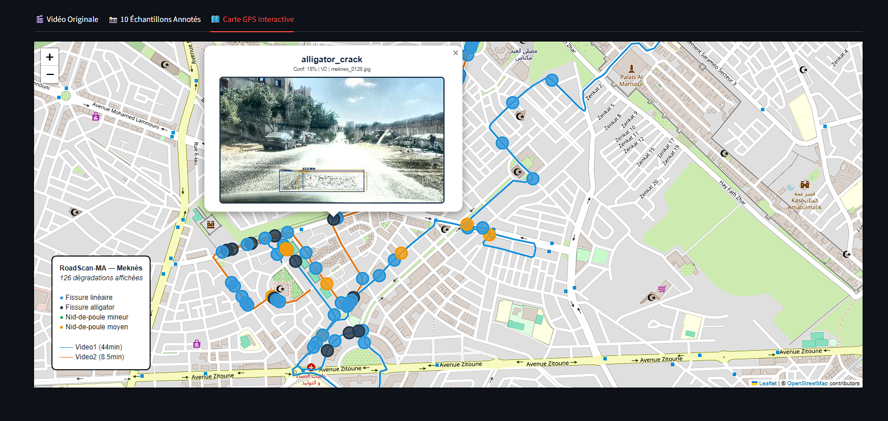

# RoadScan-MA

Detection automatique des degradations routieres avec cartographie GPS pour les municipalites marocaines.
Projet IATD - ENSAM Meknes 2026

## Architecture

## Resultats

| Modele | mAP50 | Classes | Dataset |
|--------|-------|---------|---------|
| yolo_final/best.pt | 0.452 | 5 classes | D1+D2+D4+BG |
| Classificateur cracks | 95% accuracy | linear vs alligator | D1+D2 |

## Classes

| ID | Classe |
|----|--------|
| 0 | linear_crack |
| 1 | alligator_crack |
| 2 | minor_pothole |
| 3 | medium_pothole |
| 4 | major_pothole |

## Dataset

Dataset complet annote YOLO :
https://www.kaggle.com/datasets/mohamedaminebelasri7/roadscan-dataset/data

- 5831 images YOLO format
- Train: 4663 | Val: 581 | Test: 587
- Sources: RDD2022 India + lorenzoarcioni + D4 severity + background
- Nettoyage: confident learning 3 modeles

Videos terrain Meknes (Video1 44min + Video2 8.5min) : disponibles sur demande via Google Drive

## Installation

pip install -r requirements.txt
streamlit run app.py

## Stack

Python - YOLOv8 - Streamlit - Folium - OpenCV - ReportLab - GPX

## Demo

